# Запуск через Docker Compose

1. **Запустіть сервіси через docker-compose:**
   ```bash
   docker compose up -d 
   ```

2. **Перевірте роботу контейнерів:**
   ```bash
   docker compose ps
   ```

3. **API буде доступний через nginx-проксі:**
   - Відкрийте у браузері: http://localhost:8080
   - Всі запити до API проходять через nginx (reverse proxy)

4. **Зупинити сервіси:**
   ```bash
   docker compose down
   ```

1. **docker compose up -d, docker ps**
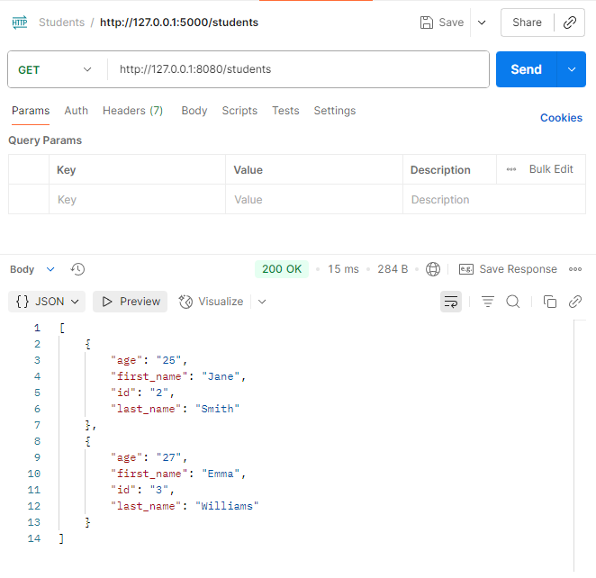
2. **GET /students** — отримати всіх студентів


---

# Запуск через Docker

1. **Зберіть Docker-образ:**
   ```bash
   docker build -t dz12-api .
   ```
2. **Запустіть контейнер:**
   ```bash
   docker run --rm -d -p 8000:8000 --name dz12-api-container dz12-api
   ```

Контейнер буде доступний на порту 8000.
1. **DOCKER_BUILD**
   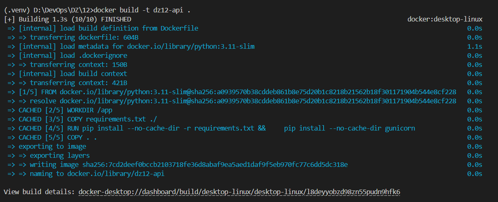
2. **DOCKER_RUN**
   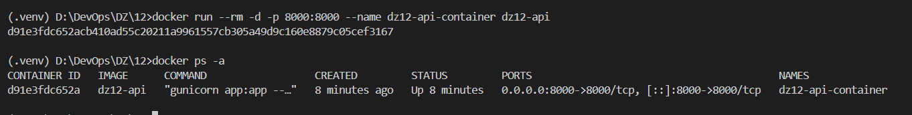
3. **GET /students** — отримати всіх студентів
   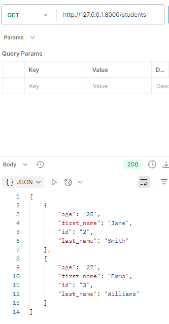
4. **PUT /students/5** — оновити всі дані студента (успіх)
    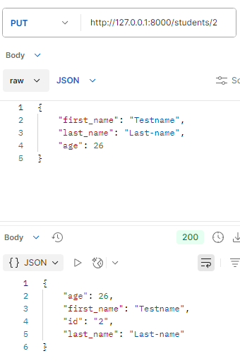

---

# Flask Students API

## Як запустити проект

1. **Створіть віртуальне оточення**
   ```bash
   python -m venv .venv
   ```

2. **Активуйте віртуальне оточення**
   - **Windows:**
     ```bash
     source .venv/Scripts/activate
     ```
   - **Linux/macOS:**
     ```bash
     source .venv/bin/activate
     ```


3. **Встановіть необхідні пакети**
   > **Рекомендується:**
   ```bash
   pip install -r requirements.txt
   ```
   > Якщо потрібно, можна перевірити всі встановлені пакети командою `pip freeze`, але для запуску проєкту достатньо requirements.txt.

4. **Запустіть сервер**
   ```bash
   python app.py
   ```

5. **Запустіть тести для API**
   ```bash
   python test_requests.py
   ```

## Використання API

- **GET /students** — отримати список всіх студентів
- **GET /students/<id>** — отримати студента за id
- **GET /students/lastname/<last_name>** — отримати студентів за прізвищем
- **POST /students** — додати нового студента (тіло: first_name, last_name, age)
- **PATCH /students/<id>** — оновити лише вік студента (тіло: age)
- **PUT /students/<id>** — оновити дані студента
- **DELETE /students/<id>** — видалити студента

## Примітки
- Дані зберігаються у файлі `students.csv`, який ігнорується у git.
- Всі налаштування та залежності описані у цьому README.

## Опис результатів та скріншоти

Нижче наведено послідовність виконання всіх методів API згідно з вимогами завдання. Для кожного кроку додано скріншот із результатом (див. папку Screenshots):


1. **GET /students** — отримати всіх студентів
   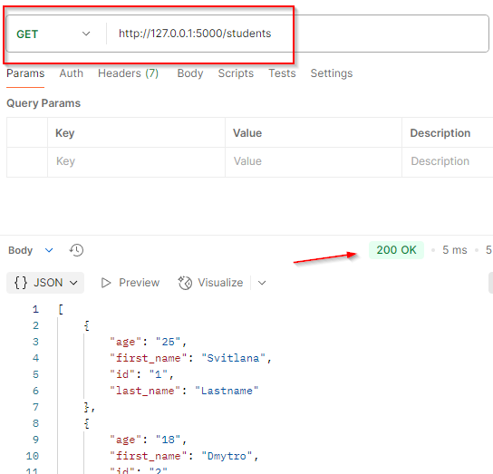
2. **GET /students/2** — отримати студента за id (успіх)
   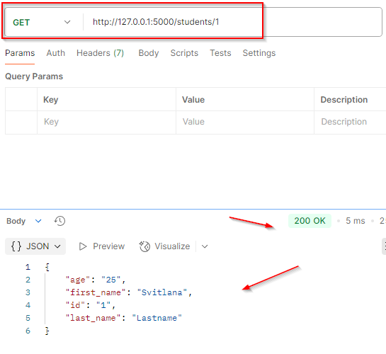
3. **GET /students/2** — отримати студента за id (помилка: не знайдено)
   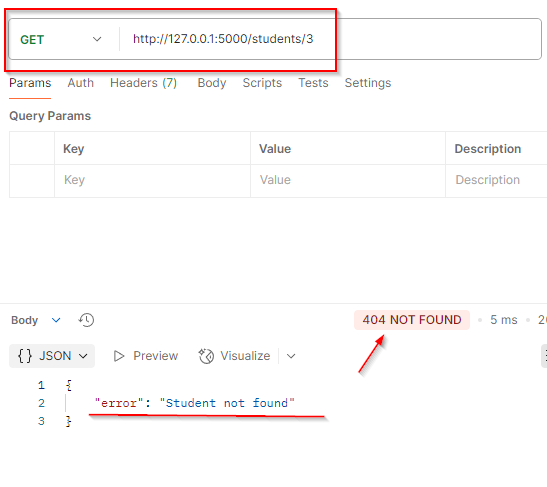
4. **GET /students/lastname/Smith** — отримати студентів за прізвищем (успіх)
   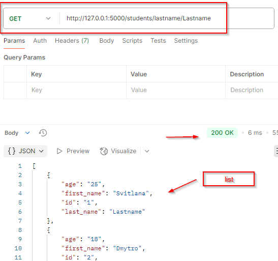
5. **GET /students/lastname/Unknown** — отримати студентів за прізвищем (помилка)
    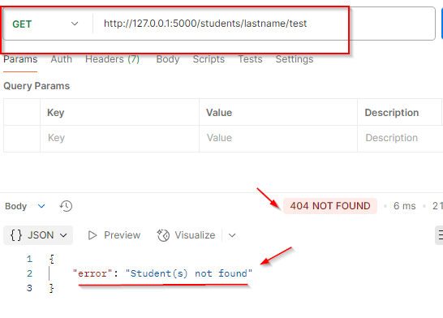
6. **POST /students** — створити нового студента (успіх)
   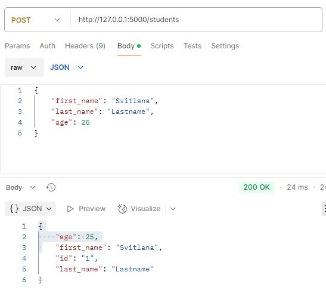
7. **POST /students** — створити нового студента (успіх, ще один)
   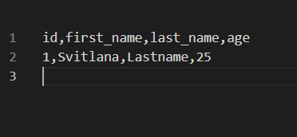
8. **POST /students** — помилка: відсутнє поле вік
   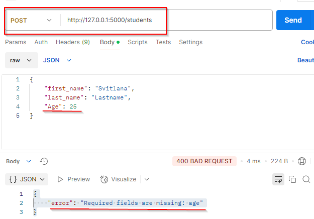
9. **POST /students** — помилка: не валідне поле
   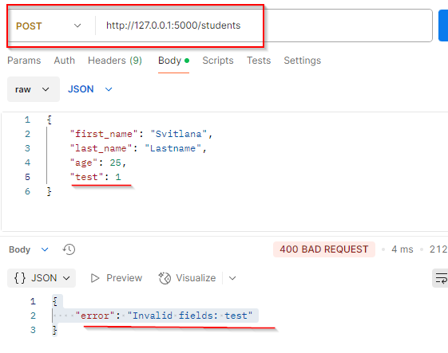
10. **POST /students** — помилка: студент з таким id вже існує
   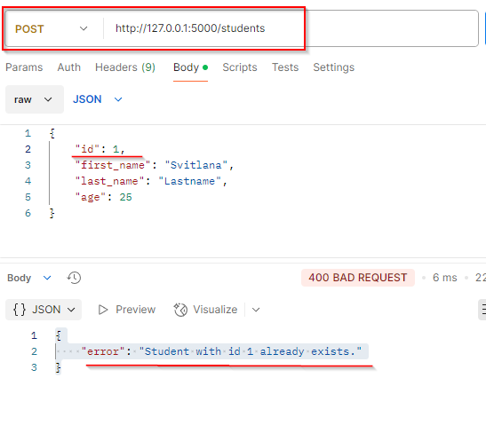
11. **PUT /students/5** — оновити всі дані студента (успіх)
    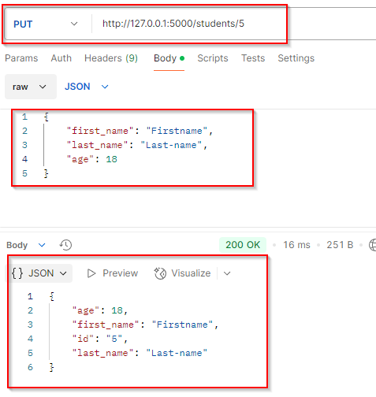
12. **PUT /students/5** фбо **PUT /students/9** — оновити всі дані студента (логування)
    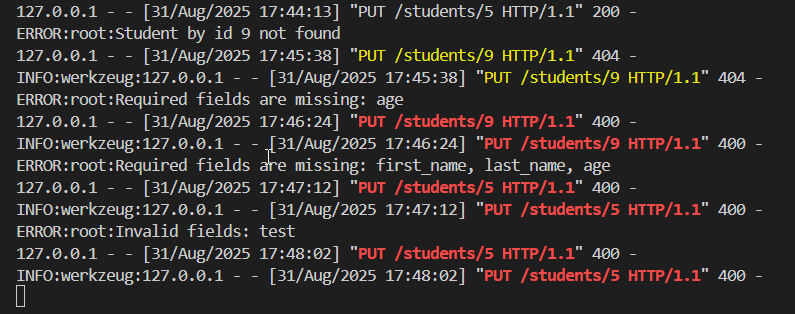
13. **PUT /students/9** — оновити всі дані студента (помилка: студента не знайдено)
    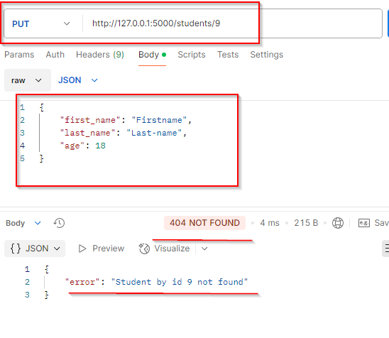
14. **PUT /students/5** — оновити всі дані студента (помилка: відсутнє поле вік)
    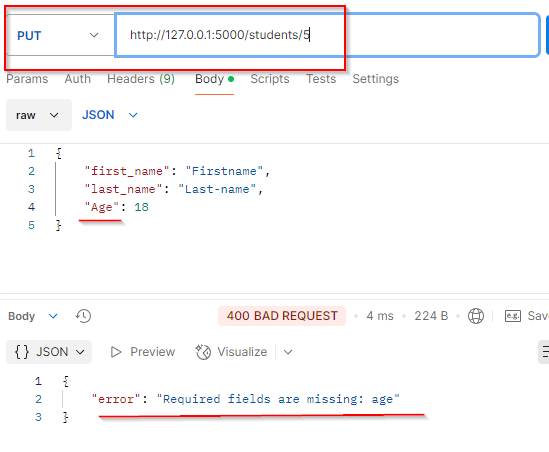
15. **PUT /students/3** — оновити всі дані студента (помилка: відсутні поля)
    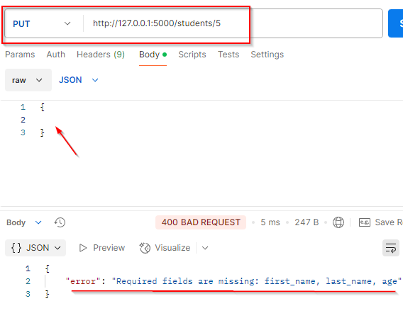
16. **PUT /students/3** — оновити всі дані студента (помилка: не валідне поле)
   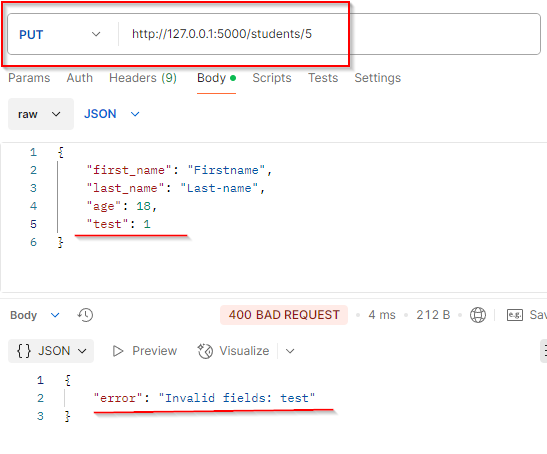
17. **PATCH /students/2** — оновити вік студента (успіх)
   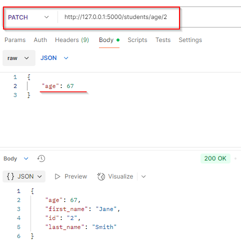
18. **PATCH /students/9** — оновити вік студента (помилка: не знайдено студента за id)
   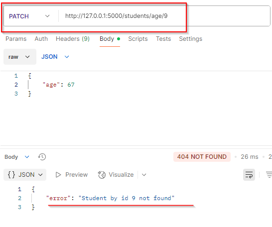
19. **PATCH /students/2** — оновити вік студента (помилка: не передано поле age)
   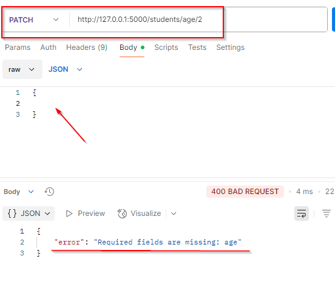
20. **PATCH /students/2** — оновити вік студента (помилка: невалідне поле)
   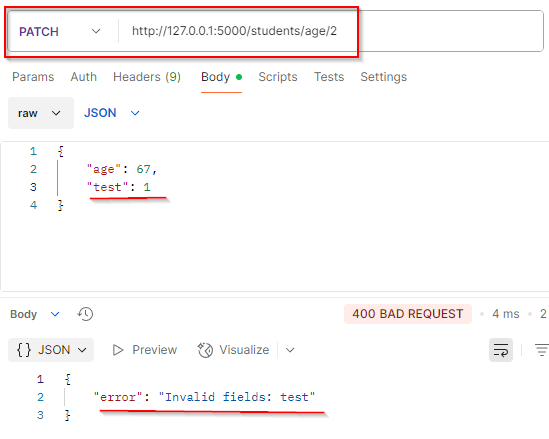
21. **DELETE /students/2** — видалити студента (успіх)
    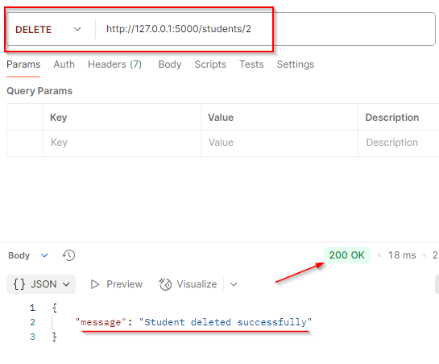
22. **DELETE /students/4** — видалити студента (помилка: не знайдено студента за id)
    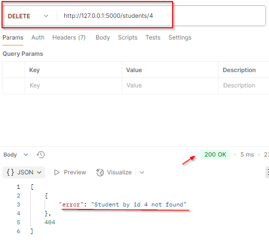

---
